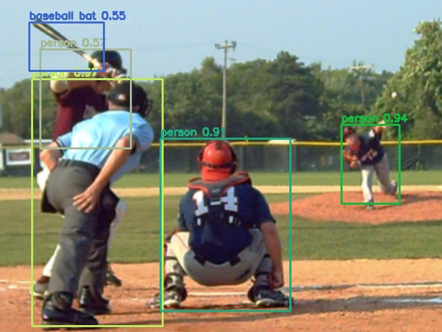

# Object Detection case study

## Comparison of models from FaceBook's Detectron-project and YOLOv3

We compared the performance of models from FaceBook's Detectron project and YOLOv3 model from Joseph Redmon, when different error sources were added. The models from FaceBook's Detectron project were FasterRCNN, MaskRCNN and RetinaNet.

## Data

We used 118 288 jpg images (COCO train2017) to train the models. 5000 images (COCO val2017) were used to calculate the mAP-50 scores.

Detectron's model zoo had pretrained weights for FasterRCNN, MaskRCNN and RetinaNet. YOLOv3's weights were trained by us, using the Kale cluster of University of Helsinki. The training took approximately five days when two NVIDIA Tesla V100 GPUs were used. 

## Error types (Filters) used in the case study

* Gaussian blur

* Added rain

* Added snow

* JPEG compression

* Resolution change

### Gaussian blur filter

The error parameter here is the standard deviation (std) for the Gaussian distribution.

#### Example images using the filter:

##### std: 0.0

##### std: 1.0

##### std: 2.0

##### std: 3.0

#### The results of Gaussian Blur filter

### Rain filter

The error parameter here is the probability of rain.

#### Example images using the filter:

##### probability: 0.0001

##### probability: 0.001

##### probability: 0.01

##### probability: 0.1

#### The results of Rain filter 

### Snow filter

The error parameter here is the probability of snow. The other parameters had static values as follows: 
"snowflake_alpha": 0.4, "snowstorm_alpha": 0

#### Example images using the filter:

##### probability: 0.0001

##### probability: 0.001

##### probability: 0.01

##### probability: 0.1

#### The results of Snow filter

### JPEG Compression

The error parameter here is the quality of JPEG-compression. The higher the value, the better quality the picture has.

#### Example images using the filter:

##### quality: 10

##### quality: 20

##### quality: 30

##### quality: 100

#### The results of JPEG Compression filter

### Resolution

The error parameter makes the resolution k times smaller.

#### Example images using the filter:

##### Value of k: 1

##### Value of k: 2

##### Value of k: 3

##### Value of k: 4

#### The results of Resolution filter

