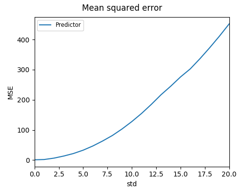
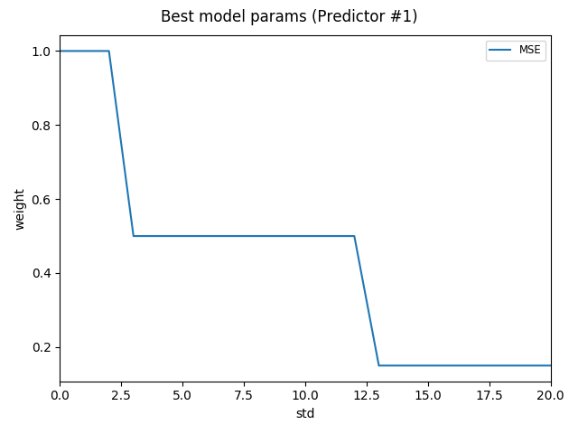

Usage
=====

dpEmu consists of three components:

  * A system for building an error generator
  * A system for running the AI models with different error parameters
  * Tools for visualizing the results

Error Generation
^^^^^^^^^^^^^^^^

For a quick hands-on introduction to error generation in dpEmu, see the
`Error Generation Basics tutorial <tutorials/Error_Generation_Basics.ipynb>`_.

Error generation in dpEmu consists of three simple steps:

 * Defining the structure of the data by constructing an error generation tree.
 * Attaching filters (error sources) to the tree.
 * Calling the generate_error method on the root node of the tree.

Creating an Error Generation Tree
---------------------------------

Error generation trees consist of tree nodes. The most common type of leaf node
is the ``Array``, which can represent a Numpy array (or Python list) of any
dimension. Even a scalar value can be represented by an ``Array`` node provided
that node is not the root of the tree. If the fundamental unit of your data is
a tuple (as is the case with, e.g. .wav audio data), use a Tuple node as the
leaf.

The simplest and most commonly used non-leaf node type is the ``Series``.
The ``Series`` represents the leftmost dimension of any unit of data passed to
it. For example, you might choose to represent a matrix of data as a series of
rows. In that case you would then create an ``Array`` node to represent a row
and provide it as the argument to a ``Series`` node:

.. code-block:: python

    from dpemu.nodes import Array, Series

    row_node = Array()
    root_node = Series(row_node)

A TupleSeries represents a tuple where the first (i.e. leftmost) dimensions of
the tuple elements are in some sense "the same". For example, if we have one
Numpy array, X, containing the input data and another, Y, containing each data
point's correct label, we may choose to represent (X, Y) as a TupleSeries.

There is usually more than one valid way to represent the structure of the data
as a tree. For example, a 2d Numpy array can be represented as:

 * a matrix, i.e. a single Array node
 * a list of rows, i.e. a Series with an Array as its child
 * a list of lists of scalars, i.e. a Series whose child
   is a Series whose child is an Array.

Adding Filters (Error Sources)
------------------------------

Filters can be added to leaf nodes such as ``Array`` or ``Tuple`` nodes.
Dozens of filters (e.g. ``Snow``, ``Blur`` and ``SensorDrift``) are provided
out of the box. They can be used to manipulate practically any kind of data,
including but not limited to images,time series and sound. Users can also
create their own custom error sources by subclassing the ``Filter`` class.

To create a filter, call the constructor and provide string identifiers for
the error parameters of that filter. To attach the filter to a leaf node,
call the node's ``addfilter`` method with the filter object as the parameter.

Calling the generate_error Method
---------------------------------

Once you have defined your error generation tree and added the desired filters,
you can call the generate_error method of the root node of the tree. The method
takes two arguments:

 * the data into which the errors are to be introduced, and
 * a dictionary of error parameters.

The parameter dictionary contains the error parameter values that are to be
used in the error generation. The keys corresponding to the values are the
error parameter identifier strings which you provided to the Filter
constructor(s).

The generate_error method does not overwrite the original data but returns
a copy instead.

This is an example of what the error generation process might look like:

.. code-block:: python
    :linenos:

    from dpemu.nodes import Array, TupleSeries
    from dpemu.problemgenerator.filters import Missing, GaussianNoise

    # Assume our data is a tuple of the form (x, y) where x has
    # shape (100, 10) and y has shape (100,). We can think of each
    # row i as a data point where x_i represents the values of the
    # explanatory variables and y_i represents the corresponding
    # value of the response variable.
    x = np.random.rand(100, 10)
    y = np.random.rand(100)
    data = (x, y)

    # Build a data model tree.
    x_node = Array()
    y_node = Array()
    root_node = TupleSeries([x_node, y_node])

    # Add a filter to introduce NaN values (i.e. missing data)
    # in y.
    y_node.addfilter(Missing("p"))

    # Add another filter to produce Gaussian noise in x.
    x_node.addfilter(GaussianNoise("mean", "std"))

    # Define the error parameters and feed the data to the root node.
    probability = .3
    noise_mean = 0.0
    noise_std = .1
    params = {"p": probability,
              "mean": noise_mean,
              "std": noise_std}
    output = root_node.generate_error(data, params)

In the example the error generation tree has a ``TupleSeries`` as its
root node, which in turn has two ``Array`` nodes as its children. Then on
line 19 we add a ``Missing`` filter to one of the children, which will
transform some of the values in the 1-dimensional array ``y`` to NaN.
The filter is given a parameter with value *"p"*, which means that the key
for the probability for transforming a number into NaN is going to be
*"p"* in the parameter dictionary.

We then create a GaussianNoise filter and attach it to ``x_node``, the
other child of the root node. The GaussianNoise filter takes two string
identifier arguments, corresponding to the mean and standard deviation
of the Gaussian distribution from which the noise is drawn.

Finally we call the ``generate_error`` method of the root node, providing
it with the data and the error parameter dictionary. The method returns
an errorified copy of the data. However, if you wish to run a machine
learning model on the data, the ML runner – to be discussed next – will
call the method for you.

AI runner system
^^^^^^^^^^^^^^^^

The AI runner system, or simply runner, is a system which is used for running multiple AI models simultaneously with distinct filter error parameters by using multithreading. After running all the models with all wanted parameter combinations 
the system returns a ``pandas.DataFrame`` object which can later be used for visualizing the results.

The runner needs to be given the following values when it is run: train data, test data, a preprocessor, an error generation tree, a list of error parameters, a list of AI models and their parameters and a boolean about whether to use interactive mode or not.

Train data and test data
""""""""""""""""""""""""
These are the original train data and test data which will be given to the AI models. A value ``None`` can also be passed to the runner if there is no train data.

Preprocessor
""""""""""""

The preprocessor needs to implement a function ``run(train_data, test_data)`` and it returns the preprocessed train and test data. The preprocessor can return additional data as well, and it will be listed as separate columns in the ``DataFrame`` which the runner returns.
Here is a simple example of a preprocessor, which does nothing to the original data, but returns also an array called *"negative_data"* which contains the additive inverse of each test_data's element.

.. code-block:: python
    :linenos:
    
    class Preprocessor:
        def __init__(self):
            self.random_state = RandomState(42)

        def run(self, train_data, test_data):
            negative_data = -test_data
            return train_data, test_data, {"negative_data": negative_data}

Error generation tree
"""""""""""""""""""""

The root node of the error generation tree should be given to the runner. The structure of the error generation tree is described above.

Error parameter list
""""""""""""""""""""

The list of error parameters is simply a list of dictionaries which contain the keys and error values for the error generation tree.

AI model parameter list
"""""""""""""""""""""""

The list of AI model parameters is a list of dictionaries containing three keys: *"model"*, *"params_list"* and *"use_clean_train_data"*. 

The value of *"model"* is **a class instead of an object**. 
The given class should implement the function ``run(train_data, test_data, parameters)`` which runs the model on the train data and test data with given parameters and returns a dictionary containing the scores and possibly additional data.

The value of *"params_list"* is a list of dictionaries where each dictionary contains one set of parameters for model. The model will be given these parameters when the ``run(train_data, test_data, parameters)`` function is called.

If the *"use_clean_train_data"* boolean is true, then no error will be added to the train data.

Here is an example AI model parameter list and a model:

.. code-block:: python
    :linenos:

    from numpy.random import RandomState 
    from sklearn.cluster import KMeans
    from sklearn.metrics import adjusted_rand_score
    from sklearn.metrics import adjusted_mutual_info_score

    # Model
    class KMeansModel:
        def __init__(self):
            self.random_state = RandomState(42)

        def run(self, train_data, test_data, model_params):
            labels = model_params["labels"]

            n_classes = len(np.unique(labels))
            fitted_model = KMeans(n_clusters=n_classes,
                                  random_state=self.random_state
                           ).fit(test_data)

            return {
                "AMI": round(adjusted_mutual_info_score(labels, 
                                                        fitted_model.labels_,
                                                        average_method="arithmetic"),
                             3),
                "ARI": round(adjusted_rand_score(labels, fitted_model.labels_), 3),
            }

    # Parameter list
    model_params_dict_list = [
        {"model": KMeansModel, "params_list": [{"labels": labels}]}
    ]

Interactive mode
""""""""""""""""

The final parameter of the runner system is a boolean telling whether to use interactive mode or not.
Some of the functions for visualizing the results require the interactive mode, for some of them it's optional
and most of them have no interactive functionality.

Basically what the interactive mode does is that it adds a column containing the modified test data to the resulting ``DataFrame`` object.
The interactive visualizer functions use this data to display points of data so that e.g. the programmer can try to figure out why
something was classified incorrectly.

Visualization functions
^^^^^^^^^^^^^^^^^^^^^^^

The module ``src.plotting`` has a file ``utils.py`` which contains multiple functions for plotting and visualizing the data.

A Complete Example
------------------

Here is an unrealistic but simple example which demonstrates all three components of dpEmu. In this example we are trying to predict 
the next value of data when we know all earlier values in the data. Our model tries to do estimate this by keeping a weighted average.
In the end of the example a plot of scores is visualized.

.. code-block:: python
    :linenos:

    import sys

    import matplotlib.pyplot as plt
    import numpy as np

    from dpemu import runner
    from dpemu.plotting_utils import visualize_scores, print_results_by_model, visualize_best_model_params
    from dpemu.problemgenerator.array import Array
    from dpemu.problemgenerator.filters import GaussianNoise

    class Preprocessor:
        def run(self, train_data, test_data, params):
            return train_data, test_data, {}

    class PredictorModel:
        def run(self, train_data, test_data, params):
            # The model tries to predict the values of test_data
            # by using a weighted average of previous values
            estimate = 0
            squared_error = 0

            for elem in test_data:
                # Calculate error
                squared_error += (elem - estimate) * (elem - estimate)
                # Update estimate
                estimate = (1 - params["weight"]) * estimate + params["weight"] * elem

            mean_squared_error = squared_error / len(test_data)

            return {"MSE": mean_squared_error}

    def get_data(argv):
        train_data = None
        test_data = np.arange(int(sys.argv[1]))
        return train_data, test_data

    def get_err_root_node():
        # Create error generation tree that has an Array node
        # as its root node and a GaussianNoise filter
        err_root_node = Array()
        err_root_node.addfilter(GaussianNoise("mean", "std"))
        return err_root_node

    def get_err_params_list():
        # The standard deviation goes from 0 to 20
        return [{"mean": 0, "std": std} for std in range(0, 21)]

    def get_model_params_dict_list():
        # The model is run with different weighted estimates
        return [{
            "model": PredictorModel,
            "params_list": [{'weight': w} for w in [0.0, 0.05, 0.15, 0.5, 1.0]],
            "use_clean_train_data": False
        }]

    def visualize(df):
        # Visualize mean squared error for all used standard deviations
        visualize_scores(
            df=df,
            score_names=["MSE"],
            is_higher_score_better=[False],
            err_param_name="std",
            title="Mean squared error"
        )
        visualize_best_model_params(
            df=df,
            model_name="Predictor #1",
            model_params=["weight"],
            score_names=["MSE"],
            is_higher_score_better=[False],
            err_param_name="std",
            title=f"Best model params"
        )

        plt.show()

    def main(argv):
        # Create some fake data
        if len(argv) == 2:
            train_data, test_data = get_data(argv)
        else:
            exit(0)

        # Run the whole thing and get DataFrame for visualization
        df = runner.run(
            train_data=train_data,
            test_data=test_data,
            preproc=Preprocessor,
            preproc_params=None,
            err_root_node=get_err_root_node(),
            err_params_list=get_err_params_list(),
            model_params_dict_list=get_model_params_dict_list()
        )

        print_results_by_model(df)
        visualize(df)

    if __name__ == "__main__":
        main(sys.argv)

Run the program with the command:

.. code-block:: bash

    python3 examples/run_manual_predictor_example 1000

Here's what the resulting image should look like:

Best model parameters for different standard deviation values:

How to run examples
-------------------

**Run the examples from project root.**

If the examples do not require command line arguments, then they can be run as follows:

.. code-block:: bash

    python3 examples/run_saturation_example_rgb_0_to_1.py

If the examples require command line arguments, add them after the name of the file, each one separated by space (the argument 22 tells the angle of the counterclockwise rotation of the picture):

.. code-block:: bash

    python3 examples/run_rotate_example.py 22

The interactive mode is activated above by writing ``-i``

.. code-block:: bash

    python3 examples/run_text_classification_example test 4 -i
